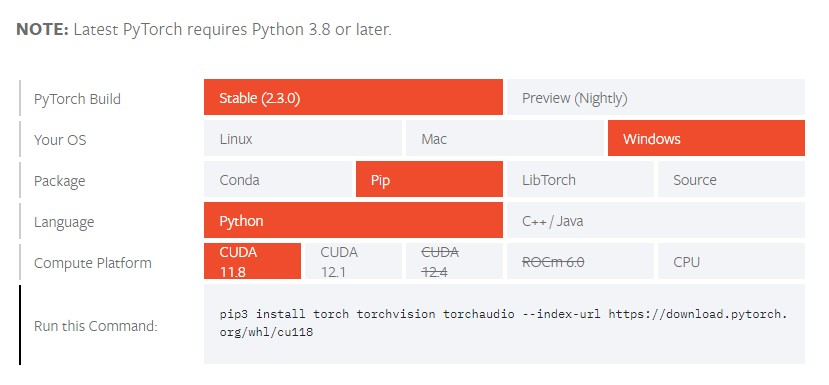
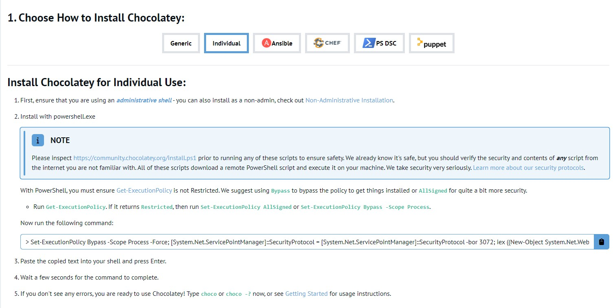

# Speech Recognition using Whisper AI in Python

This desktop application can choose a desired file (.mp4) from local file path to make it a subtitle to be in it.

## Set Up

### Git

* Download this git to your desire local place

### Python

* Go to : https://www.python.org/downloads/
* Download and install the app.
* Check in the command prompt.
* Type `python -v`.

### Whisper AI, Pysrt, moviepy, tk

* Open command prompt.
* Type `pip install openai-whisper pysrt tk moviepy`

### PyTorch Installation

* Go to : [https://packaging.python.org/guides/tool-recommendations/](https://pytorch.org/get-started/locally/)
* Choose the specification you desire.

* Copy the command after choosing the selection.
* Run command prompt (windows) then paste the command.

### Chocolatey and ffmpeg installation 

* Go to : https://chocolatey.org/install
* Choose individual and copy the command.

  

* Open windows PowerShell as Administrator.
* Paste the command and wait for download.
* After complete, run `choco install ffmpeg`
* All should be done

## Running the program

* You can use command prompt or Visual studio code to run the program.
  
### Command Prompt
* Go to the path directory.
* Type `python main.py`
* The app should be popped up.

### Microsoft Visual Studio
* Open the `main.py`.
* Run the code, then the app will be pop up

## Using the program

* The program should be look like this
  
* First you need to select the video (.mp4) from your local drive
* Then you choose language and model (Both must be filled)
  
* After that, there will be a new file that contain audio file (.mp3), subtitle file (.srt), and text file (.txt)
* The new ly video that had been added the subtitle will be named `"file name"+subtitle.mp4`
